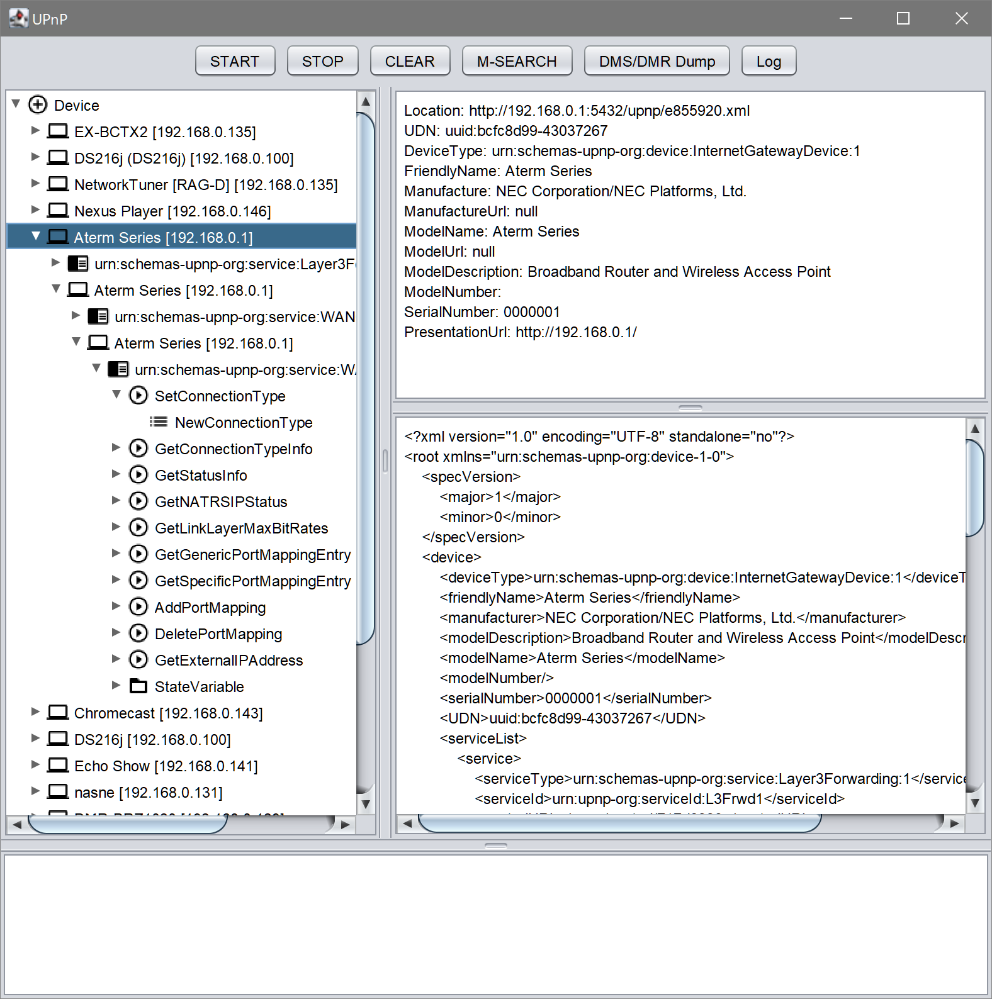

# mmupnp

[](./LICENSE)
[](https://github.com/ohmae/mmupnp/releases)
[](https://github.com/ohmae/mmupnp/issues)
[](https://github.com/ohmae/mmupnp/issues)
[](https://travis-ci.org/ohmae/mmupnp)
[](https://codecov.io/gh/ohmae/mmupnp)
[](https://bintray.com/ohmae/maven/net.mm2d.mmupnp)
[](https://bintray.com/ohmae/maven/net.mm2d.mmupnp)

Universal Plug and Play (UPnP) ControlPoint library for Java / Kotlin.

## Feature

- Pure Kotlin implementation.
- Available in both Java/Kotlin application and Android apps.
- Easy to use
- High response

## Requirements

- kotlin 1.3 or later
- Java 7 or later

## Restrictions

- This library only provides ControlPoint.
There is no way to make Device. If you need it, please select another library.

## Example of use

Android App

- DMS Explorer --
[[Google Play](https://play.google.com/store/apps/details?id=net.mm2d.dmsexplorer)]
[[Source Code](https://github.com/ohmae/DmsExplorer)]

Sample App

|||
|-|-|


## API Documents

I described Javadoc/KDoc comments. Please refer to it for more information.

- [KDoc for 3.x.x](https://ohmae.github.io/mmupnp/dokka/mmupnp/) (English)
- [Javadoc for 2.x.x](https://ohmae.github.io/mmupnp/javadoc/) (Japanese)

## How to use

Download from jCenter.
Add dependencies, such as the following.

```gradle
repositories {
    jcenter()
}
dependencies {
    implementation 'net.mm2d:mmupnp:3.1.0'
}
```

### Create instance

To create instance with default parameor.

```kotlin
val cp = ControlPointFactory.create()
```

`ControlPointFactory.create()` has many initialization parameters.

In addition, Builder is also provided.
Please use them according to your preference. It is convenient when using from Java.

```kotlin
val cp = ControlPointFactory.builder()
    .setInterfaces(interfaces)
    .setCallbackHandler { handler.post(it) }
    ....
    .build()
```

#### Initialize parameter

To specify the network interface,

```kotlin
val cp = ControlPointFactory.create(
    interfaces = listOf(NetworkInterface.getByName("eth0"))
)
```

By default ControlPoint will work with dual stack of IPv4 and IPv6.
To operate with IPv4 only, specify the protocol,

```kotlin
val cp = ControlPointFactory.create(
    protocol = IP_V4_ONLY
)
```

You can change the callback thread.
For example in Android, you may want to run callbacks with MainThread.

```kotlin
val cp = ControlPointFactory.create(
    callbackHandler = { handler.post(it) }
)
```

Or If use executor,

```kotlin
val cp = ControlPointFactory.create(
    callbackExecutor = object : TaskExecutor{
        private val executor = Executors.newSingleThreadExecutor()
        override fun execute(task: Runnable): Boolean {
            executor.execute(task)
        }

        override fun terminate() {
            executor.shutdownNow()
        }
    }
)
```

If EventSubscription is not required,

```kotlin
val cp = ControlPointFactory.create(
    subscriptionEnabled = false
)
```

The server thread for receiving events does not start and resources can be reduced.

If you want to receive multicast events,

```kotlin
val cp = ControlPointFactory.create(
    multicastEventingEnabled = true
)
```

**This feature is experimental.**
Compatibility cannot be confirmed because no other implementation has been found.

### Initialize and Start

```kotlin
val cp = ControlPointFactory.create().also {
    // adding listener if necessary.
    it.addDiscoveryListener(...)
    it.addNotifyEventListener(...)
    it.initialize()
    it.start()
}
...
```

### M-SEARCH

Call ControlPoint#search() or ControlPoint#search(String).

```kotlin
cp.search()                  // Default ST is ssdp:all
```

```kotlin
cp.search("upnp:rootdevice") // To use specific ST. In this case "upnp:rootdevice"
```

These methods send one M-SEARCH packet to all interfaces.

### Invoke Action

For example, to invoke "Browse" (ContentDirectory) action...

```kotlin
val mediaServer = cp.getDevice(UDN)           // get device by UDN
val browse = mediaServer.findAction("Browse") // find "Browse" action
browse?.invoke(
    mapOf(
        "ObjectID" to "0",
        "BrowseFlag" to "BrowseDirectChildren",
        "Filter" to "*",
        "StartingIndex" to "0",
        "RequestedCount" to "0",
        "SortCriteria" to ""
    ),
    onResult = {
        val resultXml = it.get("Result")// get result
        ...
    },
    onError = {
        // on error
        ...
    }
)
```

### Event Subscription

For example, to subscribe ContentDirectory's events...

```kotlin
// add listener to receive event
addEventListener( eventListener { service, seq, properties ->
    properties.forEach {
        eventArea.text = "${eventArea.text}${service.serviceType} : $seq : ${it.first} : ${it.second}\n"
    }
})
val mediaServer = cp.getDevice(UDN)          // get device by UDN
val cds = mediaServer.findServiceById(
  "urn:upnp-org:serviceId:ContentDirectory") // find Service by ID
cds.subscribe()                              // Start subscribe
...
cds.unsubscribe()                            // End subscribe
```

Of course, this will not work if disabled at initialization.

### Stop and Terminate

```kotlin
cp.stop()
cp.terminate()
```

It is not possible to re-initialize.
When you want to reset, try again from the constructor call.

### Debug log output

This library use [log library](https://github.com/ohmae/log),

To enable debug log.

```kotlin
Logger.setLogLevel(Logger.VERBOSE)
Logger.setSender(Senders.create())
```

In this case output to `System.out`

To send log to a library,
eg. Simply change the output method.

```kotlin
Logger.setSender(DefaultSender.create({ level, tag, message ->
    message.split('\n').forEach {
        android.util.Log.println(level, tag, it)
    }
}))
```

eg. To handle exception

```kotlin
Logger.setSender { level, message, throwable ->
    if (level >= Log.DEBUG) {
        SomeLogger.send(...)
    }
}
```

Please see [log library](https://github.com/ohmae/log) for more details

#### Log leveling

- ERROR
  - Log indicating the possibility of a problem occurring.
- WARN
  - Log indicating the possibility of a problem occurring, but also often output in normal operation.
- INFO
  - Logs that may help analyze the problem, but may be output in large amounts.
- DEBUG
  - Logs that output in normal operation for debugging.
- VERBOSE
  - More detail logs that output in normal operation for debugging.

## Dependent OSS

- [Kotlin](https://kotlinlang.org/)
  - org.jetbrains.kotlin:kotlin-stdlib-jdk7
- [log](https://github.com/ohmae/log)
  - net.mm2d:log

## Special thanks

This project is being developed with IntelliJ IDEA Ultimate,
thanks to be approved to Jetbrains Free Open Source Licenses.

[](https://www.jetbrains.com/?from=mmupnp)

## Author

大前 良介 (OHMAE Ryosuke)
http://www.mm2d.net/

## License

[MIT License](./LICENSE)
